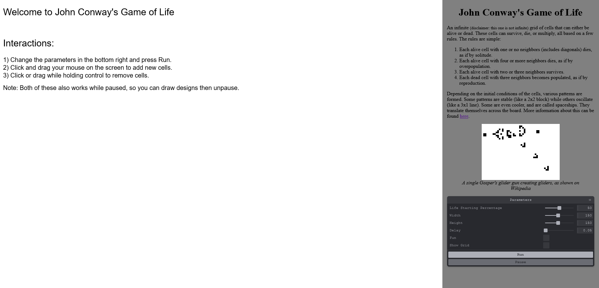
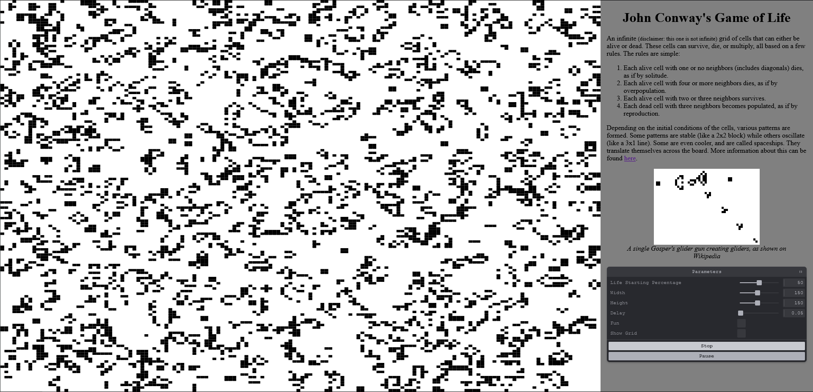

Assignment 4 - Creative Coding: Interactive Multimedia Experiences
===

## Conway's Game of Life

https://a4-jonathan-metcalf.glitch.me/

The goal of this application is to simulate John Conway's Game of Life while allowing the user to make adjustments to input parameters and interact with it while it is simulating. This website uses the Canvas API to display the 2D grid of cells and tweakpane to expose parameters to users.

The parameters that are exposed to the user is the percent of life that starts on the board, the width and height of the grid, the delay between "frames" of the simulation, a "fun" mode which randomizes the colors of the cells, and whether the grid should be shown.

Additionally, users can also pause the simulation while it is executing. While it is running or paused, users can click or drag their mouse on the canvas to create new cells, and hold control and click or drag their mouse on the canvas to remove cells.

The main challenge I faced was determining how to draw the cells on the canvas, especially taking into account the ability to add and remove cells by using the mouse. I had to determine what the coordinates in the canvas were based on the row/col of the cell, which I did by calculating the cell width and height based on the size of the canvas and the user-provided width and height. It was the opposite process to change the values of cells based on the MouseEvent coordinates, but I again used the cell width/height to translate it back.

Other than that, I only had a small challenge including tweakpane, which did not work when installed as a node module. I had to eventually add it as a CDN script to load from.

An example of the website before starting a simulation

An example of the simulation running